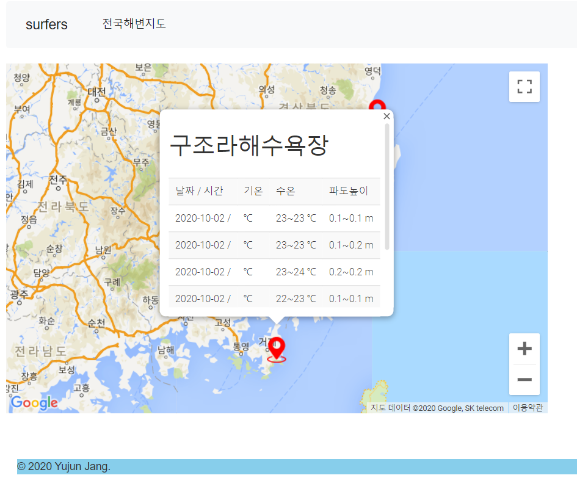

# Korean beach information
---

Python Django framework + Open API

Open API in
http://www.khoa.go.kr/oceangrid/khoa/takepart/openapi/openApiKey.do

Google Map API
https://maps.googleapis.com/maps

opened in summer
